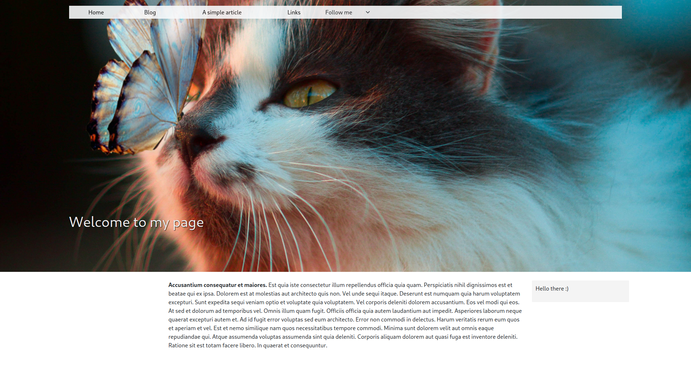
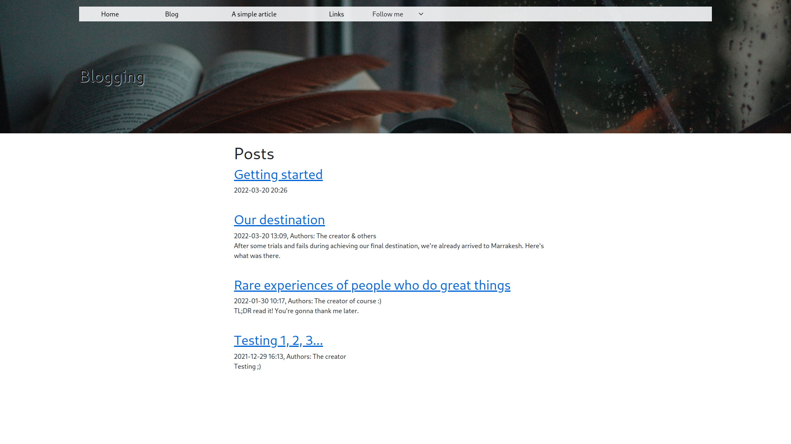
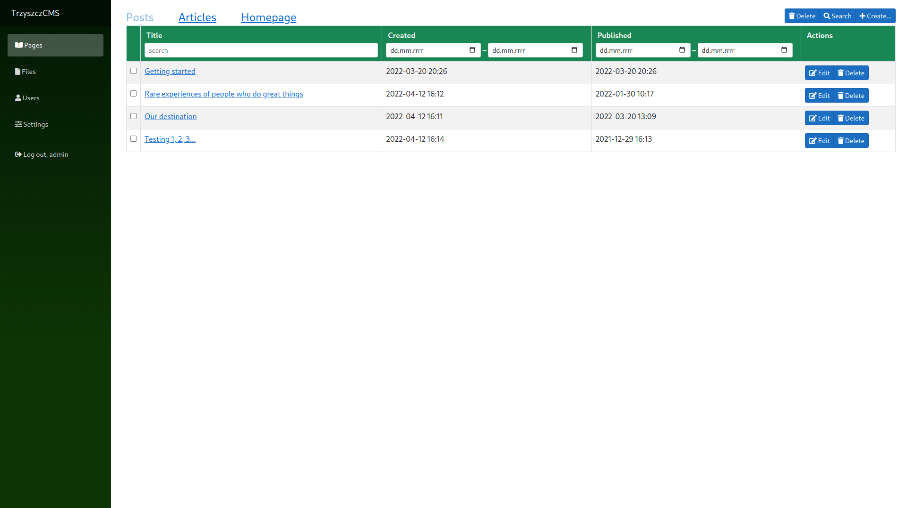
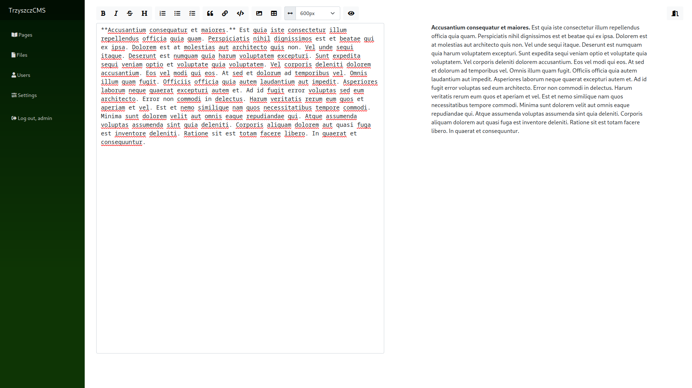
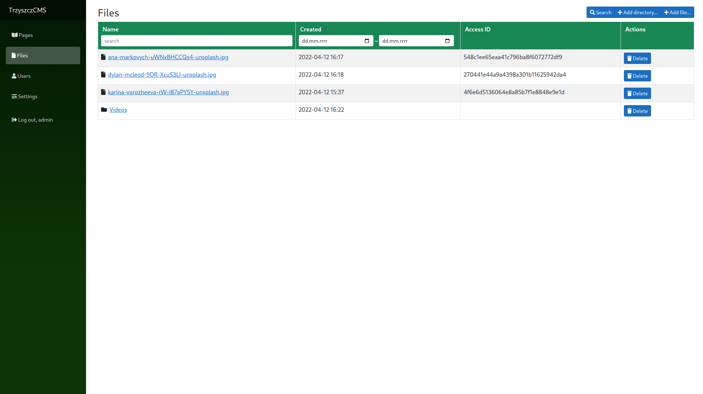
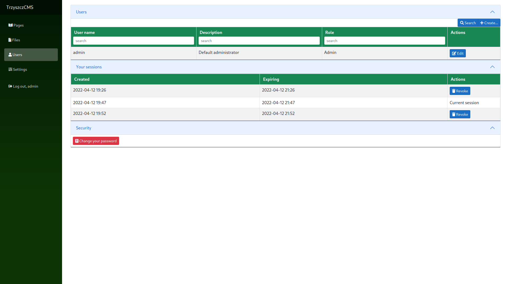

<div align="center">
	
	<div style="font-weight: bold; margin-bottom: 10px;">TrzyszczCMS</div>
</div>


# About

A simple content management system for creating and organising layout and content of the website. Written in _C#_ with usage of _Blazor WebAssembly_.

# Features
* Simple and pretty presenting of pages and their content.
* Managing pages, these are posts and articles (it names so non-blog pages)
* Managing layout of pages and their elements' location and granular properties
* Writing pages' text in MarkDown.
* User management with usage of roles and access policies
* Files management
* There is no need to know CSS or HTML for management, although you may still use it
* Safe user session management and credentials processing, e.g. session token revocation, signing in.
* The client application runs as Progressive Web Application (PWA) and it is possible to installed it within a web browser.

# Screenshots
|||
|--|--|
|||
|||

Sources of pictures:
* [Screenshot 1](https://unsplash.com/photos/rW-I87aPY5Y)
* [Screenshot 2](https://unsplash.com/photos/uWNxBHCCQs4)


# Requirements
* Operating system: any supported by _.NET_ (Linux, macOS, Windows).
* _.NET6_ runtime.
* PostgreSQL.

# Default credentials
* Login: ```admin```
* Password: ```Testing123$```

# Docs & development
You can find the basic docs of this project right [here](docs/TrzyszczCMS.Docs/articles/table-of-contents.md). Please read it before committing to the project.

At present the following project is suspended at its work as it is used for representative purposes only (CVs).
If you would like to contribute to the project, or you think that it is worth to develop further, read the project's [code of conduct](CODE_OF_CONDUCT.md).
